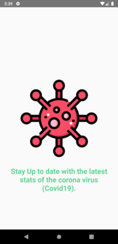
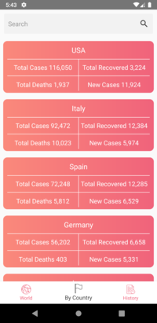

# CoronavirusWorldStatus
an app to stay up to date with the latest stats of the coronavirus 
This App is using [Coronavirus monitor API](https://rapidapi.com/astsiatsko/api/coronavirus-monitor) as a remote data source

Getting Started
---------------
In order to run this project , you will need to create an account and get a key from [the rapid api](https://rapidapi.com/)

Screenshots
-----------

## Libraries Used
* [ViewModel](https://developer.android.com/topic/libraries/architecture/viewmodel) - store and manage UI-related data in a lifecycle conscious way
* [LiveData](https://developer.android.com/jetpack/arch/livedata) - notify the view when data changes .
* [Lifecycle](https://developer.android.com/topic/libraries/architecture/lifecycle) - perform action when lifecycle state changes
* [Room](https://developer.android.com/topic/libraries/architecture/room) - SQLite database with in-app objects and compile-time checks
* [DataBinding](https://developer.android.com/topic/libraries/data-binding/) - bind UI components to data sources
* [Material](https://material.io/develop/android/docs/getting-started/) - Material Components.
* [Coroutine](https://github.com/Kotlin/kotlinx.coroutines#user-content-android) - performs background tasks
* [Retrofit2](https://square.github.io/retrofit/)- networking
* [Gson](https://github.com/google/gson) - convert Java Objects into their JSON and vice versa
* [Dagger2](https://dagger.dev/users-guide) - dependency injector
* [Timber](https://github.com/JakeWharton/timber) - Logger
* [Stetho](http://facebook.github.io/stetho/) - debug bridge
